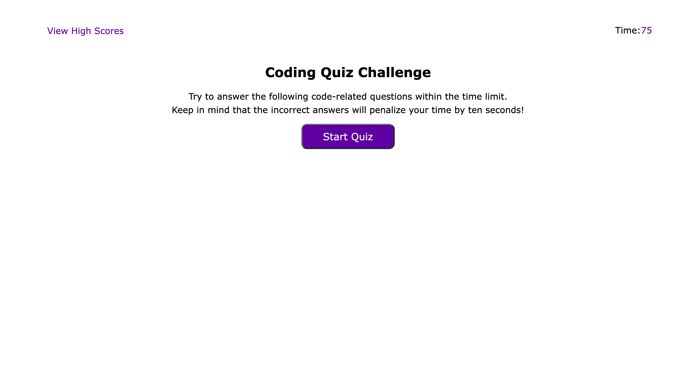

# 04-Challenge

## Description

The 04-Challenge project involved the use of DOM elements to create a coding quiz.

When the start button is clicked by the user, the start page elements are replaced with the quiz questions and the quiz timer begins counting down by the second. The questions move forward as the user makes answer choice selections. If the answer choice is correct, text will display and the user's score increases by 10 points. If the answer choice is incorrect, text will display and 10 seconds are subtracted from the timer.

The quiz ends when the user get through all questions or if the timer reaches 0 seconds. The user can enter their initial and submit their score to the High Score page. The user can go back to the quiz start page and restart the quiz or they can clear the score results.

## Mock Up

The following image shows the Web API Code Quiz appearance and functionality:

## Link

https://swaguespack.github.io/03-challenge/